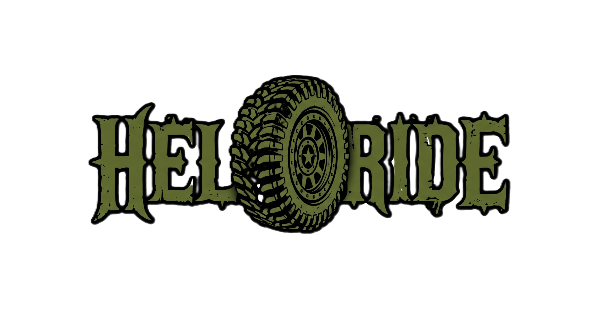

HellRide is a high-performance, visually immersive web application featuring advanced 3D animations and a robust security-focused administrative backend. Built with a modern tech stack, it prioritizes smooth user experiences and secure data management.

---

### 🚀 Live Repository
[View Source Code](https://hellride.codewithchib.eu.cc)

### 🛠 Tech Stack

| Frontend | Backend & Build | Animations |
| :--- | :--- | :--- |
|  **HTML5** |  **Node.js** |  **GSAP** |
|  **CSS3** |  **Vite** |  **3D Canvas** |
|  **JavaScript** |  **NPM** |  **Lenis Scroll** |

---

### ✨ Key Features

#### 🎨 3D Visuals & Smooth Motion
*   **3D Canvas:** Integrated 3D elements utilizing GSAP for high-performance, interactive visual experiences.
*   **Lenis Scroll:** Implementation of smooth momentum scrolling to enhance the cinematic feel of the site.
*   **GSAP Animations:** Timeline-based animations for seamless transitions and scroll-triggered effects.

#### 🛡 Admin & Security System
*   **Lead Management:** A dedicated admin interface designed to track and manage incoming leads efficiently.
*   **System Security:** Multi-layered security protocols to ensure the integrity of the administrative panel and lead data.
*   **Authentication:** Secure access controls for the administrative backend.

---

### 📦 Installation & Setup

1.  **Clone the repository:**
    ```bash
    git clone [https://github.com/chibsaabji/HellRide.git]
    
    ```

2.  **Navigate to the project directory:**
    ```bash
    cd HellRide
    
    ```

3.  **Install dependencies:**
    ```bash
    npm install
    
    ```

4.  **Run the development server:**
    ```bash
    npm run dev
    
    ```

---

### 📜 Development Details
This project utilizes a modern development workflow with Vite. The frontend layout is constructed with custom CSS to ensure unique design implementation, while the backend utilizes Node.js for handling administrative tasks and security logic.
